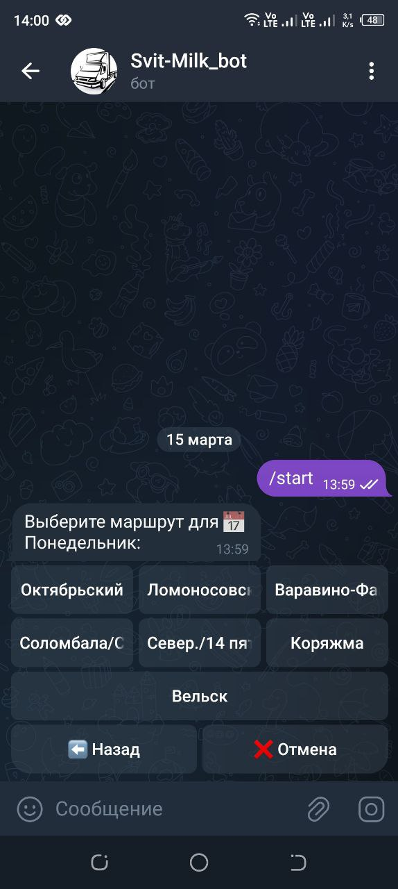

# Telegram Bot with Comments Feature

Этот Telegram-бот позволяет пользователям просматривать маршруты, адреса и оставлять комментарии к адресам. В последнем обновлении были внесены изменения в интерфейс и логику работы с комментариями.

---

## Структура проекта
   - bot.py — основной файл с логикой бота.

   - bot_db.json — файл с данными о маршрутах и адресах.

   - comments_db.json — файл для хранения комментариев.

   - settings.ini — файл конфигурации с токеном бота.

   - README.md — документация проекта.

## Что изменилось?

### 1. **Кнопка "Назад" под кнопкой "Добавить комментарий"**
   - Теперь кнопка "⬅️ Назад" располагается **под кнопкой "💬 Добавить комментарий"** на экране просмотра адреса.
   - Это улучшает навигацию и делает интерфейс более интуитивным.

### 2. **Удаление сообщений после отправки комментария**
   - После успешной отправки комментария:
     - Удаляется сообщение с запросом комментария.
     - Удаляется сообщение пользователя с текстом комментария.
   - Это предотвращает накопление сообщений в чате и делает его более чистым.

### 3. **Очистка `callback_data`**
   - В `callback_data` для кнопок теперь используются только допустимые символы (буквы, цифры, `_`, `-`).
   - Это устраняет ошибку `Button_data_invalid`, которая возникала из-за недопустимых символов.

### 4. **Улучшение логики обработки комментариев**
   - Если комментарий уже существует, он отображается вместе с кнопкой "⬅️ Назад".
   - Если комментария нет, отображается кнопка "💬 Добавить комментарий" и кнопка "⬅️ Назад".

---

## Как использовать бота?

1. **Запустите бота командой `/start`**:
   - Бот предложит выбрать день недели.

2. **Выберите день и маршрут**:
   - После выбора дня отобразятся доступные маршруты.
   - После выбора маршрута отобразятся адреса.

3. **Просмотр и добавление комментариев**:
   - Нажмите на адрес, чтобы просмотреть комментарий (если он есть).
   - Если комментария нет, нажмите "💬 Добавить комментарий", чтобы оставить его.
   - После отправки комментария он сохранится, а сообщения с запросом и комментарием будут удалены.

4. **Возврат к предыдущим шагам**:
   - Используйте кнопку "⬅️ Назад", чтобы вернуться к предыдущему шагу.

---

## Установка и запуск

1. **Установите зависимости**:
   ```bash
   pip freeze -r requirements.txt
   
Настройте конфигурацию:
Создайте файл settings.ini в корне проекта, внем укажите ваш токен
   
   [TOKEN]
   token = YOUR_TELEGRAM_BOT_TOKEN


